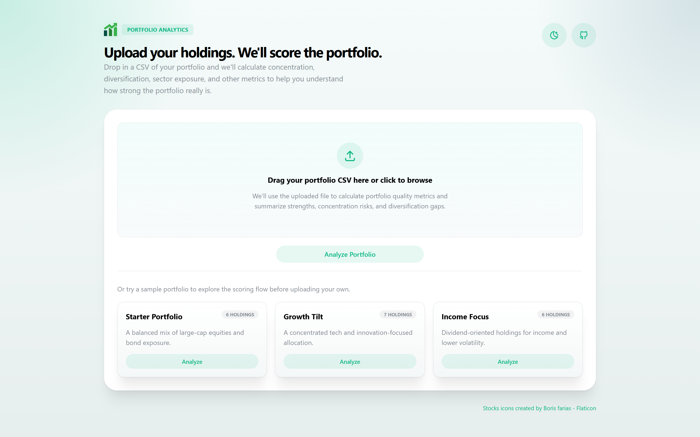
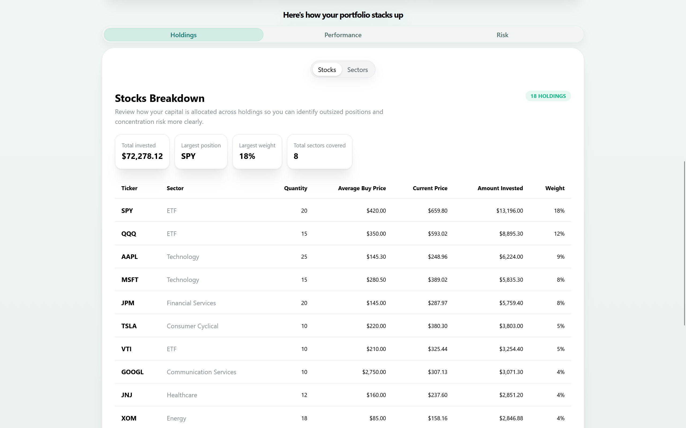
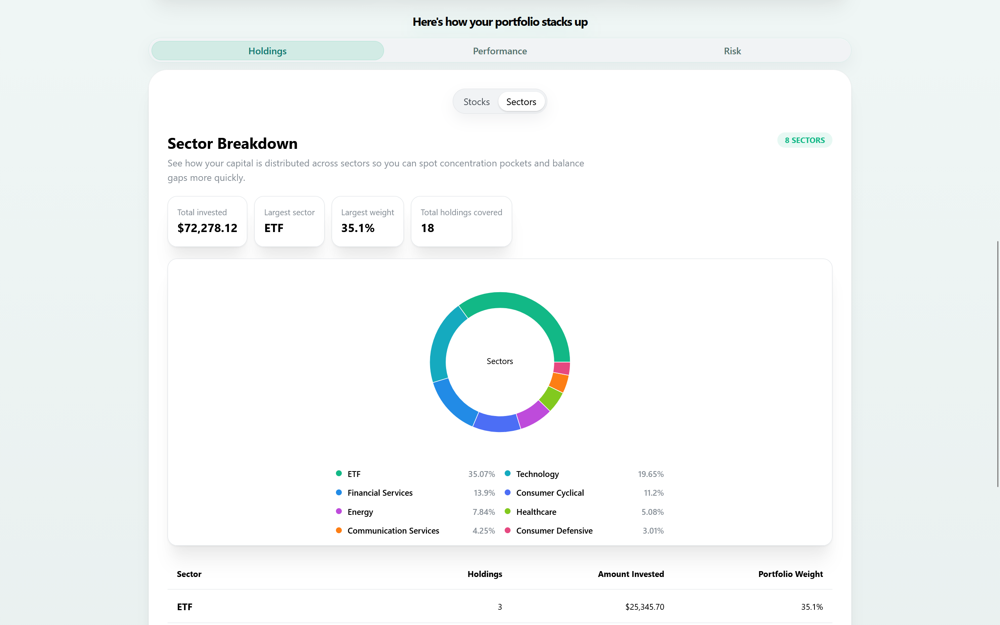
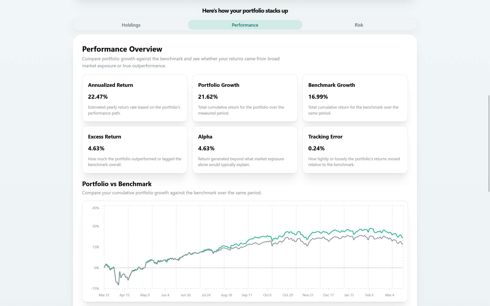
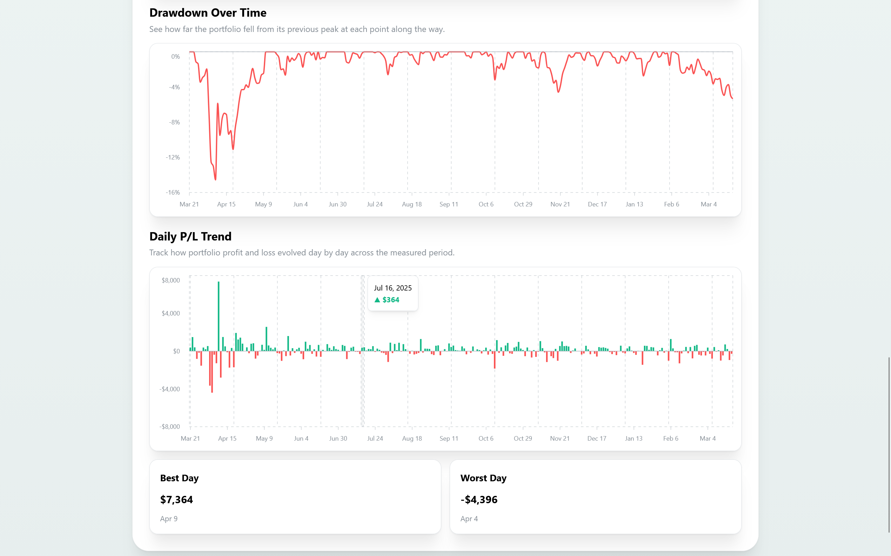
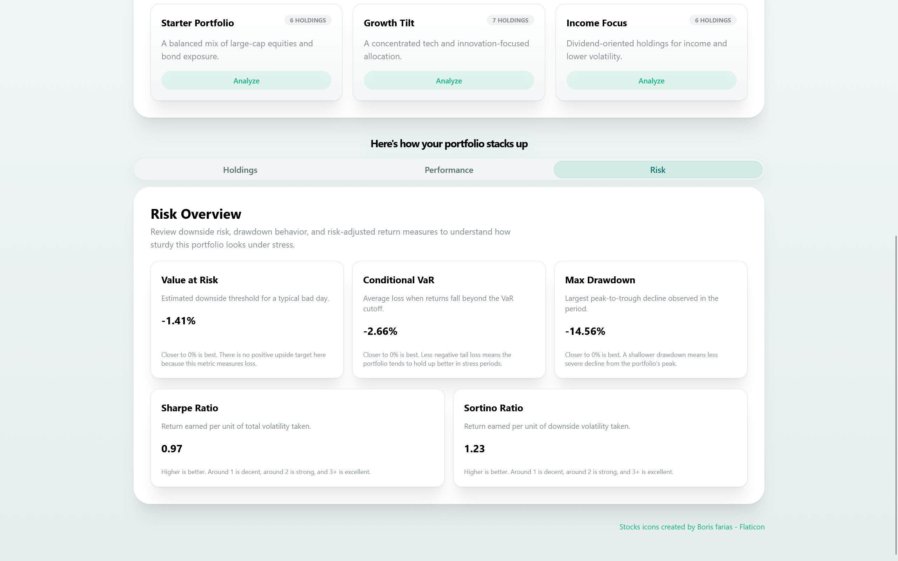
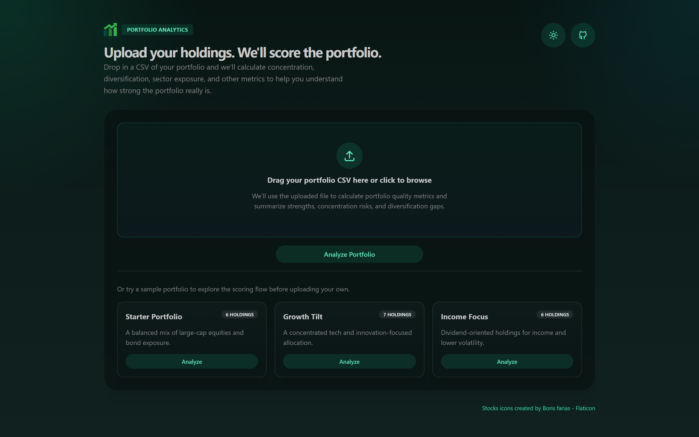
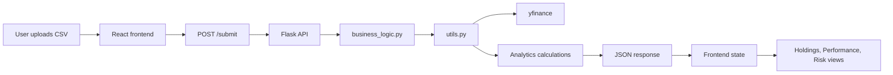
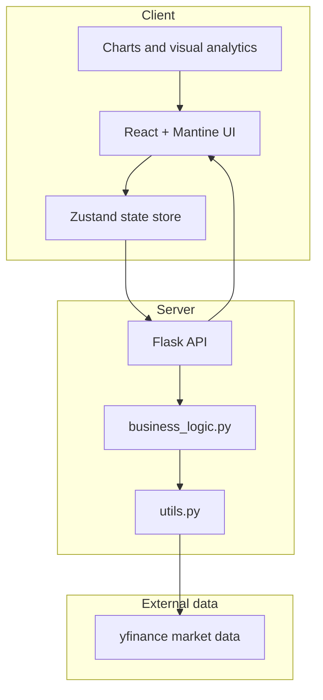

# Portfolio Analytics

Portfolio Analytics is a portfolio analysis project that turns a simple holdings CSV into a richer view of allocation, concentration, performance, and risk. It is designed as a showcase project with an analytical product feel: clean enough to demo, rigorous enough to explain, and practical enough to run as a single-service web app.

The app helps investors, hiring managers, and technically curious users answer a question that most broker dashboards and spreadsheets do not answer especially well: not just "what do I own?", but "how healthy is this portfolio as a system?"

## Overview

Portfolio Analytics accepts a CSV of positions and produces a structured analysis that includes:

- Stock-level holdings breakdown
- Sector-level allocation breakdown
- Concentration insights
- Performance summaries
- Daily profit and loss trend data
- Portfolio-vs-benchmark comparison
- Drawdown analysis
- Risk metrics such as Sharpe ratio, Sortino ratio, VaR, CVaR, and max drawdown

The project combines a modern React frontend with a Python analytics backend. In production, the backend can serve the compiled frontend so the whole app runs as a single service.

## Why This Project Exists

A typical portfolio CSV is easy to store and hard to interpret. Most users can calculate position sizes, but fewer can quickly understand:

- whether a portfolio is concentrated in a small number of names
- whether the portfolio is unintentionally overweight one sector
- whether observed returns came from market beta or true outperformance
- how severe downside risk has been in historical terms

Portfolio Analytics is built to surface those answers clearly.

## Core Features

### Holdings analysis

- Review current positions and portfolio weights
- Identify dominant holdings and concentration pockets
- Compare stock and sector breakdowns with a toggleable interface

### Sector exposure

- Aggregate positions by sector
- Visualize allocation mix with a donut chart and legend
- Highlight largest sector weight and total holdings covered

### Performance analysis

- Annualized return
- Portfolio growth vs benchmark growth
- Excess return and alpha
- Tracking error
- Daily P/L bar chart
- Portfolio vs benchmark growth chart
- Drawdown over time chart

### Risk analysis

- Sharpe ratio
- Sortino ratio
- Value at Risk
- Conditional Value at Risk
- Maximum drawdown

Each metric is presented with contextual copy so the dashboard is not just descriptive, but interpretive.

## Visual Walkthrough

The screenshots below show how the project is meant to feel in use: editorial on the surface, analytical underneath.

### Landing and upload flow

The homepage is built to feel less like a generic dashboard and more like a focused portfolio analysis experience. The hero section introduces the tool clearly, while the upload panel keeps the workflow simple: upload a CSV, inspect sample portfolios, and move directly into analysis.



### Holdings breakdown

The holdings view shows position-level concentration clearly. Instead of stopping at a raw table, it emphasizes how capital is distributed across individual names so users can quickly identify oversized exposures and imbalances.



### Sector allocation

The sector view complements the stock-level picture by aggregating exposure into broader themes. This is where users can spot hidden concentration that may not be obvious from ticker weights alone, especially when several holdings cluster into the same sector.



### Performance analytics

The performance tab focuses on interpretation, not just raw return numbers. It combines summary metrics with historical visuals so users can compare portfolio growth to a benchmark, inspect drawdowns, and understand day-to-day P/L behavior in context.





### Risk dashboard

The risk tab is designed to make technical metrics more readable. Sharpe, Sortino, VaR, CVaR, and drawdown are presented with short interpretive guidance so the page works for both technical users and less quantitative audiences.



### Dark mode

The interface also supports a dark presentation, which helps the project feel more complete as a showcase piece and keeps longer analysis sessions comfortable in lower-light environments.



## Example Input

The app expects a CSV with the following schema:

```csv
ticker,quantity,avg_buy_price
AAPL,10,182.50
MSFT,6,402.10
SPY,8,510.25
JPM,12,198.00
```

### CSV fields

- `ticker`: stock or ETF symbol
- `quantity`: number of shares held
- `avg_buy_price`: average purchase price per share

## Project Structure

```text
portfolio-analytics/
|-- app/                 # React + Vite frontend
|   |-- src/
|   `-- dist/            # Production frontend build output
|-- server/              # Flask analytics API and static serving
|   |-- api.py
|   |-- business_logic.py
|   |-- utils.py
|   |-- wsgi.py
|   `-- requirements.txt
|-- data/                # Supporting project data
`-- media/               # README screenshots
```

## Tech Stack

### Frontend

- React 19
- TypeScript
- Vite
- Mantine
- Mantine Charts
- Zustand
- Motion

### Backend

- Python
- Flask
- NumPy
- pandas
- yfinance

## How It Works

At a high level, the analysis pipeline follows these steps:

1. The frontend accepts a CSV upload or a sample portfolio.
2. The CSV is sent to the Flask backend as `text/csv`.
3. The backend parses the uploaded holdings into a pandas DataFrame.
4. Market data is fetched using `yfinance`.
5. The backend calculates:
   - current prices
   - sector labels
   - amount invested
   - portfolio weights
   - daily returns
   - benchmark-relative performance
   - risk metrics
6. The analytics payload is returned as JSON.
7. The frontend renders the results across Holdings, Performance, and Risk views.

### Request Flow



## Methodology

This section is intentionally high-level: the app is analytical, but still designed for product-style readability.

### Allocation

- Position weights are computed using current market value
- Sector allocation is aggregated from ticker-level sector labels
- Concentration is inferred from large position and sector weights

### Performance

- Historical daily returns are calculated from closing price data
- Portfolio returns are computed as weighted daily returns across holdings
- Benchmark comparison uses `SPY` as the reference series
- Cumulative growth is derived from compounded daily returns
- Annualized return is scaled using `252` trading days

### Risk

- Sharpe ratio uses annualized return relative to a fixed risk-free rate
- Sortino ratio isolates downside volatility
- VaR and CVaR are estimated from the lower tail of historical daily returns
- Max drawdown is measured from rolling peaks in cumulative return series

## Local Development

There are two good ways to run this project locally:

- single-service flow
- frontend-only dev flow with the Flask server running separately

### Prerequisites

- Python 3.11+
- Node.js 20+
- npm

### Option 1: Single-service flow

This matches the deployed production shape most closely.

From the project root:

1. Install frontend dependencies

```bash
cd app
npm install
```

2. Build the frontend

```bash
npm run build
cd ..
```

3. Install backend dependencies

```bash
cd server
pip install -r requirements.txt
```

4. Start the Flask server

```bash
python api.py
```

5. Open the app

```text
http://localhost:8000
```

### Option 2: Frontend dev flow

Use this if you want Vite hot reload while working on the UI.

Start the backend:

```bash
cd server
pip install -r requirements.txt
python api.py
```

In a second terminal, start the frontend:

```bash
cd app
npm install
npm run dev
```

Then open:

```text
http://localhost:5173
```

In development, the frontend sends API requests to:

```text
http://localhost:8000/submit
```

## Production Run

For production serving, the backend can serve the compiled frontend directly from `app/dist`.

The production WSGI entrypoint is:

- [wsgi.py](/./server/wsgi.py)

Example command:

```bash
cd server
gunicorn wsgi:app
```

## Environment and Configuration

The backend supports the following environment variables:

- `APP_ENV`
  Values such as `development` or `production`
- `FLASK_ENV`
  Alternate environment selector
- `HOST`
  Server bind host, defaults to `0.0.0.0`
- `PORT`
  Server port, defaults to `8000`
- `FRONTEND_ORIGIN`
  Used for local development CORS, defaults to `http://localhost:5173`
- `CORS_ORIGINS`
  Optional comma-separated origins for explicit production CORS configuration

## API Summary

The main API route is:

- `POST /submit`

It expects raw CSV text with `Content-Type: text/csv` and returns the computed analytics payload.

## Known Limitations

- Market data depends on `yfinance`, which is convenient but not guaranteed to be production-grade
- Sector metadata from upstream sources may be missing or inconsistent for some tickers
- The benchmark is currently fixed to `SPY`
- Analytics are based on historical market behavior and are not investment advice
- Hosted environments may still require caching or retries if upstream market data becomes unstable

## Roadmap

Potential next steps for the project:

- Add market data caching to reduce repeated external calls
- Improve resilience when one or more tickers return partial data
- Add exportable PDF or shareable portfolio reports
- Introduce rolling volatility and rolling return analytics
- Add benchmark selection instead of using only `SPY`
- Add saved portfolios and historical analysis sessions
- Improve methodology transparency with downloadable assumptions and formulas

## Showcase Notes

This project is intended to demonstrate:

- product thinking
- data transformation and analytics design
- full-stack integration
- financial visualization
- pragmatic deployment architecture

It is meant to sit comfortably between a polished portfolio project and a technically serious analytical tool.

## Architecture Notes

The architecture is intentionally simple:

- a React frontend handles upload, state management, and result presentation
- a Flask backend performs analytics in pandas/NumPy
- `yfinance` provides market data inputs
- the backend can serve the compiled frontend for a single-service deployment model

### System Overview



This structure keeps the app easy to reason about while still leaving room for future evolution:

- separate frontend and backend deployment if desired
- market data abstraction improvements
- caching layers
- persistence for portfolio history

For a showcase project, this balance is deliberate: simple enough to understand quickly, but structured enough to extend professionally.
